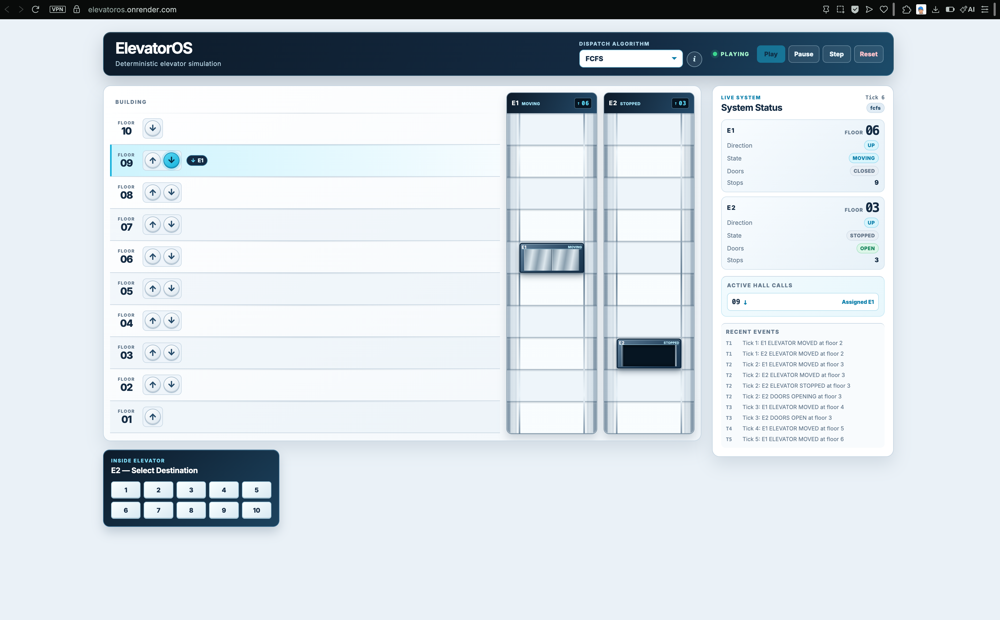

# ElevatorOS — Interactive Elevator Dispatch Simulator

**A deterministic multi-elevator simulation built with React, TypeScript, FastAPI, and Python.**

ElevatorOS lets users create hall calls, compare dispatch algorithms, watch elevators move through explicit state transitions, and select in-car destinations through a live interactive interface.


[Live App](https://elevatoros.onrender.com/) • [Features](#features) • [Architecture](#architecture) • [Algorithms](#dispatch-algorithms) • [Testing](#testing)

---

## Why I Built This

I built ElevatorOS to explore elevator dispatch beyond a static algorithm exercise: deterministic simulation, state-machine-driven movement, a clean backend/frontend boundary, and the small interaction details that matter in a real control surface.

It is a compact way to compare dispatch choices while keeping every assignment, route change, and door transition observable and reproducible.

---

## Preview



---

## Features

| Area | What it includes |
| --- | --- |
| **Simulation** | 10-floor building, two elevators, deterministic ticks, Play, Pause, Step, and Reset controls |
| **Dispatch** | FCFS baseline and direction-aware Nearest Suitable Car selection with en-route pickup insertion |
| **Interaction** | UP/DOWN hall calls, in-car destinations, live elevator status, active assignments, and recent events |
| **Reliability** | Physical invariant checks, duplicate hall-call protection, duplicate car-destination protection, and deterministic replay |

---

## Architecture

```text
React Frontend
      |
      v
FastAPI API
      |
      v
Dispatch Algorithm
      |
      v
Elevator Route / Stops
      |
      v
Deterministic Simulation Engine
      |
      v
Elevator State Machine
```

The frontend sends user actions and renders the state returned by the API; it does not simulate elevator behavior on its own.

The FastAPI layer owns the in-memory simulation session, selects a dispatch algorithm for new hall calls, and exposes the current state.

The simulation engine advances routes one tick at a time, while the elevator model enforces physical boundaries and door transitions.

---

## Hall Calls vs Car Requests

These are intentionally separate request types.

| Request | Input | What happens |
| --- | --- | --- |
| **Hall call** | Floor + direction | A dispatch algorithm selects an elevator and adds only the pickup floor. |
| **Car request** | Elevator ID + destination floor | The destination is added directly to that selected elevator's route; no dispatch is needed. |

For example, a **Floor 6 UP** call is assigned before any destination is known.

Once the doors open and the rider selects Floor 9 inside `E1`, a car request adds Floor 9 to `E1` only.

Switching algorithms affects future hall calls only; existing assignments are left in place.

---

## Dispatch Algorithms

### First-Come, First-Served (FCFS)

FCFS is the intentionally simple baseline.

It processes hall calls in the order they are received and assigns them using a simple deterministic strategy.

It does not optimize for travel distance or direction.

### Nearest Suitable Car

Nearest Suitable Car is direction- and position-aware.

It ranks elevators using the following priority order:

1. Moving toward the caller in the requested direction
2. Idle
3. Moving toward the caller in the wrong direction
4. Moving away from the caller

Within the same tier, the closer elevator wins.

Equal distances use elevator ID as the deterministic tie-breaker.

Example:

```text
Caller:
Floor 6 -> UP

E1:
Floor 5
Moving DOWN

E2:
Floor 3
Moving UP
```

E1 is physically closer, but E2 may be more suitable because it is already moving toward the caller in the requested direction.

---

## En-Route Pickup

When a compatible elevator is already moving toward the caller, ElevatorOS can insert the pickup before a farther stop.

```text
E1 at Floor 4, moving UP

Current route:
[10]

New hall call:
Floor 6 UP

Updated route:
[6, 10]
```

This prevents the elevator from passing a suitable pickup and returning later.

---

## Simulation Engine

The engine is tick-based rather than wall-clock-driven.

Given the same interaction sequence, it produces the same assignments, ordered routes, events, and state transitions every time.

```text
MOVING
  |
  v
STOPPED
  |
  v
OPENING
  |
  v
OPEN
  |
  v
CLOSING
  |
  v
CLOSED
```

The backend enforces important physical rules:

- elevators stay within building floor bounds
- elevators cannot move while doors are open
- hall calls clear only when the assigned elevator reaches the pickup floor and opens
- car requests affect only the selected elevator
- state transitions remain deterministic

---

## Duplicate Request Handling

Repeated hall-call presses are treated as one active request.

Hall calls are unique by:

```text
(origin_floor, direction)
```

For example, repeatedly pressing Floor 6 UP does not dispatch multiple elevators.

UP and DOWN calls on the same floor remain separate valid requests.

Car destinations are also deduplicated while that destination is already present in the selected elevator's route.

---

## Testing

**188 backend tests passing** cover:

- elevator movement
- floor bounds
- door state transitions
- dispatch selection
- hall calls
- car requests
- same-floor calls
- opposite-direction calls
- duplicate hall calls
- duplicate car destinations
- algorithm switching
- reset behavior
- en-route pickups
- deterministic replay
- physical invariants
- API/CORS behavior

Frontend behavior is covered with Vitest and Testing Library.

The production frontend build, backend type checks with mypy, and package installation are also verified.

> Independent stress-review verdict: **CORE SIMULATOR STABLE**

Run the backend verification suite from the repository root:

```bash
make verify
```

---

## Tech Stack

| Layer | Technologies |
| --- | --- |
| Frontend | React, TypeScript, Vite, Vitest, Testing Library |
| Backend | Python, FastAPI, Pydantic |
| Quality | Pytest, mypy |
| Deployment | Render |

---

## API

| Endpoint | Description |
| --- | --- |
| `GET /state` | Returns the current tick, algorithm, elevators, active hall calls, and recent events. |
| `POST /hall-call` | Creates and dispatches a hall call from a floor and direction. |
| `POST /car-request` | Adds a destination to one selected elevator. |
| `POST /tick` | Advances the simulation by exactly one deterministic tick. |
| `POST /reset` | Restores the default empty 10-floor, two-elevator session. |
| `POST /algorithm` | Selects FCFS or Nearest Suitable Car for future hall calls. |

---

## Running Locally

### Backend

```bash
cd backend

python -m venv .venv
source .venv/bin/activate

pip install -e .

uvicorn app.main:app --reload --port 8000
```

### Frontend

Open another terminal:

```bash
cd frontend

npm install
npm run dev
```

During local development, Vite proxies `/api/*` requests to the backend at:

```text
http://127.0.0.1:8000
```

The deployed frontend uses the `VITE_API_BASE_URL` environment variable.

---

## Project Structure

```text
ElevatorOS/
├── backend/
│   ├── app/
│   │   ├── algorithms/       # Dispatch strategies
│   │   ├── simulation/       # Domain models and deterministic engine
│   │   └── main.py           # FastAPI application
│   └── tests/                # Backend test suite
│
├── frontend/
│   └── src/                  # React simulator UI
│
├── docs/                     # Documentation and UI preview
├── Makefile
└── README.md
```

---

## License

This project is licensed under the MIT License.

---

## Future Improvements

- Average wait-time and total service-time reporting
- LOOK or SCAN dispatch strategies
- Configurable floor and elevator counts
- Algorithm performance visualizations